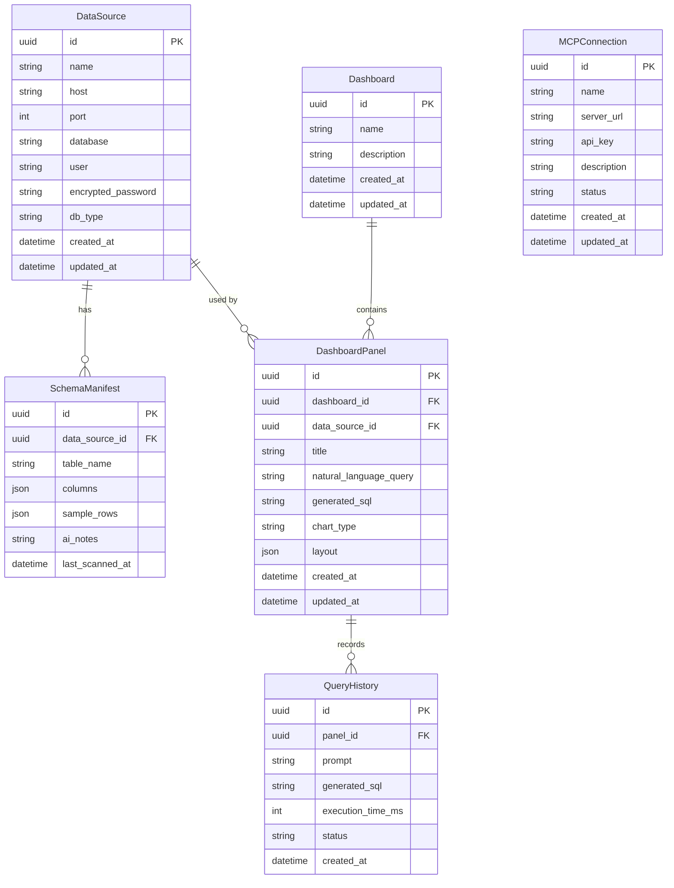

# Project ERD (Core App)

This diagram represents the internal database schema for Architect AI. It does not include the schemas of connected external data sources.

```mermaid
erDiagram
    DataSource ||--o{ SchemaManifest : "has"
    DataSource ||--o{ DashboardPanel : "used by"
    Dashboard ||--o{ DashboardPanel : "contains"
    DashboardPanel ||--o{ QueryHistory : "records"
    
    DataSource {
        uuid id PK
        string name
        string host
        int port
        string database
        string user
        string encrypted_password
        string db_type
        datetime created_at
        datetime updated_at
    }
    
    SchemaManifest {
        uuid id PK
        uuid data_source_id FK
        string table_name
        json columns
        json sample_rows
        string ai_notes
        datetime last_scanned_at
    }
    
    Dashboard {
        uuid id PK
        string name
        string description
        datetime created_at
        datetime updated_at
    }
    
    DashboardPanel {
        uuid id PK
        uuid dashboard_id FK
        uuid data_source_id FK
        string title
        string natural_language_query
        string generated_sql
        string chart_type
        json layout
        datetime created_at
        datetime updated_at
    }
    
    QueryHistory {
        uuid id PK
        uuid panel_id FK
        string prompt
        string generated_sql
        int execution_time_ms
        string status
        datetime created_at
    }
    
    MCPConnection {
        uuid id PK
        string name
        string server_url
        string api_key
        string description
        string status
        datetime created_at
        datetime updated_at
    }
```
